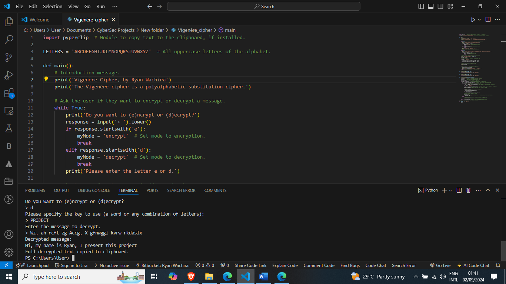

# Vigenère Cipher Project

## Overview

This project implements the Vigenère Cipher, a polyalphabetic substitution cipher, in Python. The cipher allows for encryption and decryption of messages using a keyword. The Vigenère Cipher was historically used due to its strength and resistance to cryptographic attacks for centuries.

## Features

- Encrypt and decrypt messages using a keyword.
- Supports both uppercase and lowercase letters.
- Handles non-alphabetic characters by leaving them unchanged.
- Copies the result to the clipboard for easy access (if `pyperclip` is installed).

## How It Works

The Vigenère Cipher works by shifting each letter in the plaintext by a certain number of positions determined by a repeating keyword. For example, if the keyword is "PROJECT," the first letter in the plaintext will be shifted by the position of "P" in the alphabet, the second letter by the position of "R," and so on.

### Encryption Example

```
Do you want to (e)ncrypt or (d)ecrypt?
> e
Please specify the key to use (a word or any combination of letters):
> PROJECT
Enter the message to encrypt.
> Hi, my name is Ryan, I present this project
Encrypted message:
Wz, ah rcft zg Accg, X gfnwggi kvrw rkdaslx
```


### Decryption Example

```
Do you want to (e)ncrypt or (d)ecrypt?
> d
Please specify the key to use (a word or any combination of letters):
> PROJECT
Enter the message to decrypt.
> Wz, ah rcft zg Accg, X gfnwggi kvrw rkdaslx
Decrypted message:
Hi, my name is Ryan, I present this project
Full decrypted text copied to clipboard.
```



## Installation

To run this project, you need Python installed on your system. You also need the `pyperclip` library for clipboard functionality. You can install it using pip:

```bash
pip install pyperclip
```

## Usage

1. Run the Python script.
2. Choose whether to encrypt or decrypt a message.
3. Provide a keyword for the cipher.
4. Enter the message to be encrypted or decrypted.

## Skills Gained

- Python programming
- Cryptographic concepts (encryption and decryption)
- String manipulation and loops
- Modular programming and function design

## Conclusion

The Vigenère Cipher project provided valuable experience in implementing cryptographic algorithms and handling user input in Python. It also reinforced the importance of modular code design and problem-solving in programming.
